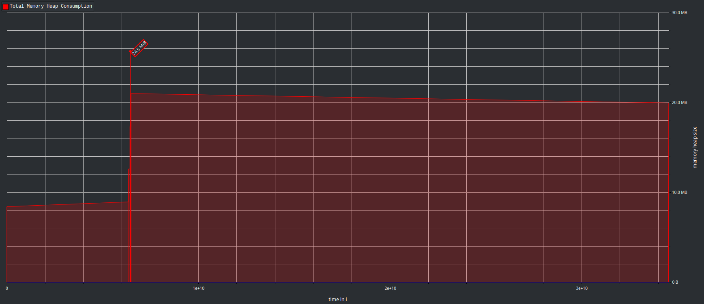
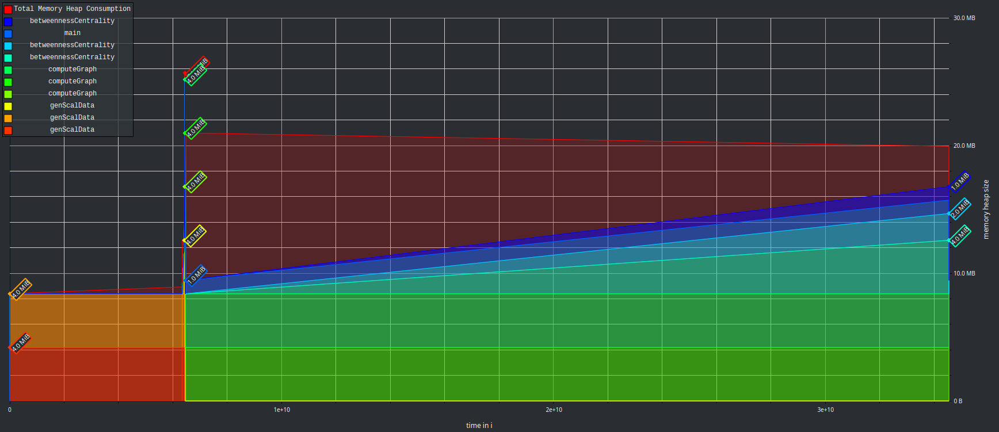

# VU Performance Oriented Computing -- Sheet 04
Author: Marco Fröhlich

## Task A -- Memory profiling

### NPB_BT
Missing output. But not so interesting.

### SSCA2

The total heap allocation peaked with $24.5$ MiB for a short amount of time and then dropping back to around $22$ MiB which then gradually reduces to $20$ MiB at the end of execution.

The allocation at peak consists mostly of blocks with an individual size of $4$ MiB. Most of these blocks instantly decrease and then build up in size over the rest of the execution time.

The runtimes of the script with and without the massif tool enabled whereas follows:

| type   | average runtime | variance  |
| ------ | --------------- | --------- |
| normal | 32.188 sec      | 0.157 sec |
| massif | 63.372 sec      | 0.597 sec |

As can be seen from the data, when the massif tool is enabled the runtime nearly doubles and the variance also increases significantly.

## Task B -- Measuring CPU counters

The events in question are the following:
**First level cache:**
-  L1-dcache-load-misses    
-  L1-dcache-loads          
-  L1-dcache-prefetch-misses
-  L1-dcache-prefetches     
-  L1-dcache-store-misses   
-  L1-dcache-stores         
-  L1-icache-load-misses    
-  L1-icache-loads 

**Last Level Cache:**         
-  LLC-load-misses          
-  LLC-loads                
-  LLC-prefetch-misses      
-  LLC-prefetches           
-  LLC-store-misses         
-  LLC-stores  

**Branch prediction**             
-  branch-load-misses       
-  branch-loads  

**Translation Look-aside Buffer:**
-  dTLB-load-misses         
-  dTLB-loads               
-  dTLB-store-misses        
-  dTLB-stores              
-  iTLB-load-misses         
-  iTLB-loads      

**local NUMA cache:**
-  node-load-misses         
-  node-loads               
-  node-prefetch-misses     
-  node-prefetches          
-  node-store-misses        
-  node-stores              

After some research I found out that most CPUs can record between 4 and 8 counters accurately at the same time. Therefor I choose to go with the lower end of this assumption and split the required events into 6 packages of 4 and one with the remaining 3 events. For none of the combinations `perf` complained that it can not record them at the same time.

Since the task asked for _relative metrics_ I computed them by dividing the misses through their associated base task for example: `L1_dcache_load_misses / L1_dcache_loads`

The following table will only contain does relative values for the miss rates average over all runs.

#### npb_bt_w
| event name                | miss rate |
| ------------------------- | --------- |
| L1_dcache-load-misses     | 0.016056  |
| L1_icache-load-misses     | 0.000261  |
| L1_dcache-prefetch-misses | -         |
| LLC-load-misses           | 0.001972  |
| LLC-store-misses          | 0.000252  |
| LLC-prefetch-misses       | 0.000020  |
| branch-load-misses        | 0.955782  |
| dTLB-load-misses          | 0.000019  |
| dTLB-store-misses         | 0.000010  |
| iTLB-load-misses          | 0.0       |
| node-load-misses          | 0.041640  |
| node-prefetch-misses      | 0.00845   |
| node-store-misses         | 0.0       |

#### ssca2 17
| event name                | miss rate |
| ------------------------- | --------- |
| L1_dcache-load-misses     | 0.382438  |
| L1_icache-load-misses     | 0.000007  |
| L1_dcache-prefetch-misses | -         |
| LLC-load-misses           | 0.105352  |
| LLC-store-misses          | 0.022076  |
| LLC-prefetch-misses       | 0.000069  |
| branch-load-misses        | 2.001323  |
| dTLB-load-misses          | 0.130439  |
| dTLB-store-misses         | 0.098822  |
| iTLB-load-misses          | 0.000003  |
| node-load-misses          | 0.000003  |
| node-store-misses         | 0.0       |

Due to the high variance in the branch loading event this metric makes no sense, since 200% miss prediction rate is nonsense, this holds for both programs. 
Otherwise, the `ssca2` program is overall a much higher data cache miss prediction rate then the other program. For both programs the instruction cache prediction rate is very good, both have nearly no miss rate. Interestingly both programs did have no L1 data cache prefetching done, this either means something was wrong with the measurement or the data fitted perfectly into cache during program load time and during runtime no prefetching was needed. It could also be that the event was not supported, this is what happened on my personal machine.

### Time perturbation

For the measurement of the time perturbation I did try a few random flag combinations and could not notice a time difference between them. In comparison with the runtime of the programs without using `perf stat` the slowdown was for `npb_bt_w` $\sim 1\%$ and for `ssca2` $\sim 0.4\%$. For `npb_bt_w` this was slightly higher than the variance with $0.3\%$, for `ssca2` the recorded variance in runtime was around $\sim 2\%$. I conclude therefor that the using `perf stat` has no significant impact in the runtime performance of programs that run longer then a few seconds.