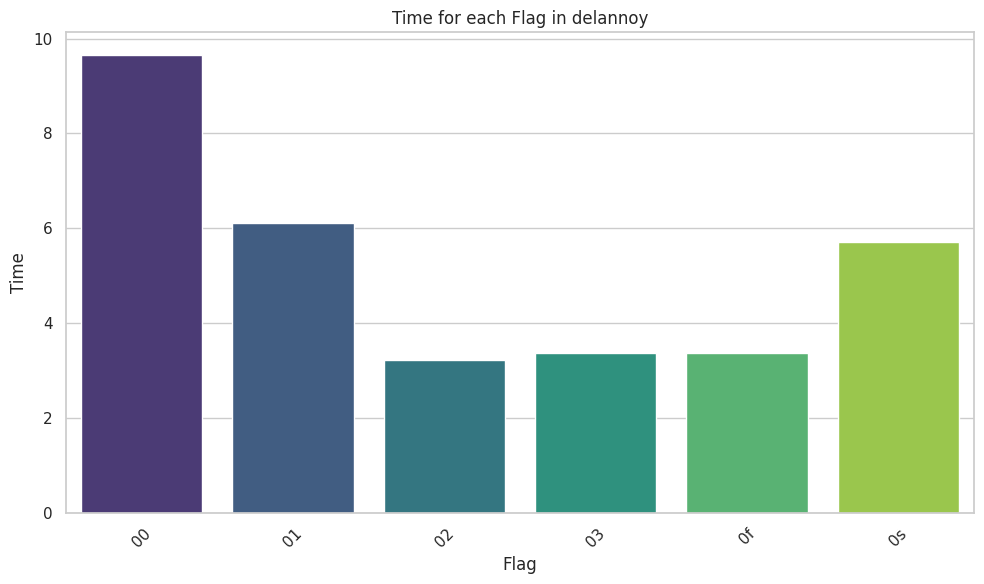
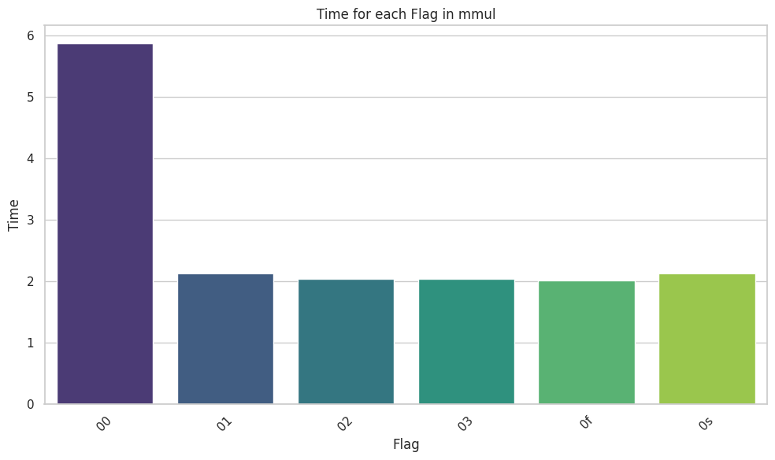
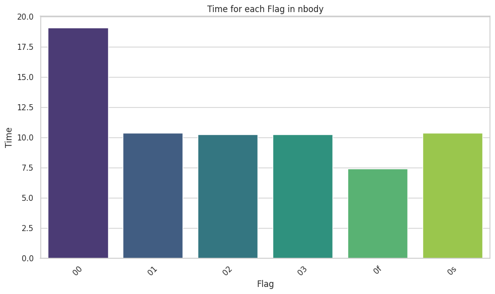
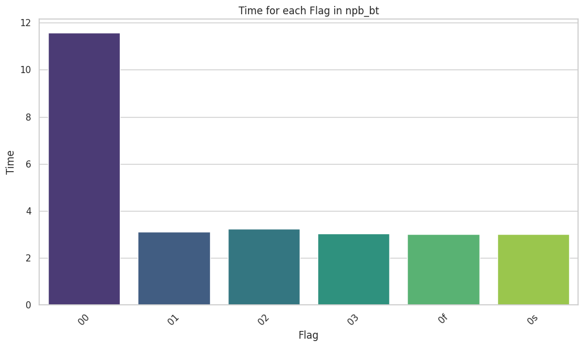
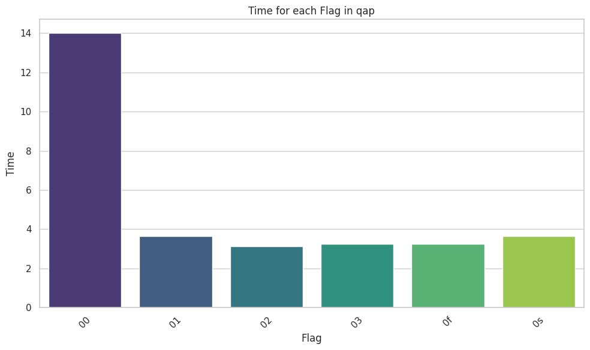
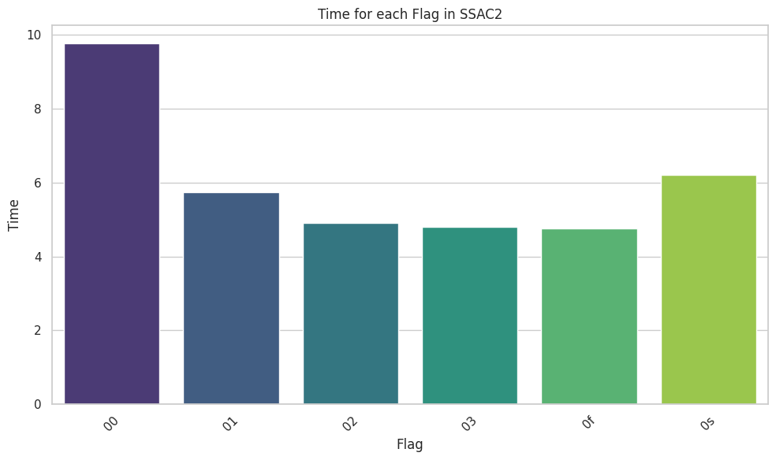

# VU Performance Oriented Computing -- Sheet 05
Author: Marco Fröhlich

# Exercise A -- Basic Optimization Levels
## Delannoy

| program  | flag | metric | time   |
| -------- | ---- | ------ | ------ |
| delannoy | 00   | real   | 9.65   |
| delannoy | 01   | real   | 6.12   |
| delannoy | 02   | real   | 3.227  |
| delannoy | 03   | real   | 3.3652 |
| delannoy | 0f   | real   | 3.368  |
| delannoy | 0s   | real   | 5.7152 |

Here `-O3` was slightly faster than `-Ofast`, and it is $\sim62\%$ faster than the slowest version with `-O0`.

## MMUL

| program | flag | metric | time   |
| ------- | ---- | ------ | ------ |
| mmul    | 00   | real   | 5.8696 |
| mmul    | 01   | real   | 2.1336 |
| mmul    | 02   | real   | 2.035  |
| mmul    | 03   | real   | 2.0396 |
| mmul    | 0f   | real   | 2.008  |
| mmul    | 0s   | real   | 2.132  |

Here `-Ofast` was the fastest, and it is $\sim65\%$ faster than the slowest version with `-O0`. But here all optimized version were very close together in terms of wall time.

## Nbody

| program | flag | metric | time    |
| ------- | ---- | ------ | ------- |
| nbody   | 00   | real   | 19.0784 |
| nbody   | 01   | real   | 10.3628 |
| nbody   | 02   | real   | 10.2492 |
| nbody   | 03   | real   | 10.248  |
| nbody   | 0f   | real   | 7.4344  |
| nbody   | 0s   | real   | 10.3592 |

Here `-Ofast` was the fastest, and it is $\sim61\%$ faster than the slowest version with `-O0`. With this program all optimized version were very close together, apart from `-Ofast` which was around $25\%$ faster than those. This is likely to the aggressive and possible inaccurate floating point arithmetics used with this optimization.

## NPB_BT

| program | flag | metric | time   |
| ------- | ---- | ------ | ------ |
| npb_bt  | 00   | real   | 11.574 |
| npb_bt  | 01   | real   | 3.1132 |
| npb_bt  | 02   | real   | 3.234  |
| npb_bt  | 03   | real   | 3.0228 |
| npb_bt  | 0f   | real   | 3.0148 |
| npb_bt  | 0s   | real   | 3.0064 |

Here very surprisingly `-Os` was the fastest even being slightly faster than `-Ofast`, and it is $\sim74\%$ faster than the slowest version with `-O0`.

## QAP

| program | flag | metric | time   |
| ------- | ---- | ------ | ------ |
| qap     | 00   | real   | 14.008 |
| qap     | 01   | real   | 3.6396 |
| qap     | 02   | real   | 3.1136 |
| qap     | 03   | real   | 3.2292 |
| qap     | 0f   | real   | 3.2296 |
| qap     | 0s   | real   | 3.6532 |

Here also interestingly `-O2` was the fastest, and it is $\sim77\%$ faster than the slowest version with `-O0`. 

## SSCA2

| program | flag | metric | time |
| ------- | ---- | ------ | ---- |
| ssac2   | 00   | real   | 9.77 |
| ssac2   | 01   | real   | 5.75 |
| ssac2   | 02   | real   | 4.90 |
| ssac2   | 03   | real   | 4.81 |
| ssac2   | 0f   | real   | 4.76 |
| ssac2   | 0s   | real   | 6.21 |

Here the `-Ofast` version was the fastest, and it is $\sim51\%$ faster than the slowest version with `-O0`.