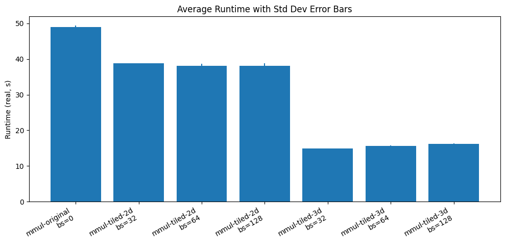

# VU Performance Oriented Computing -- Sheet 06
Author: Marco Fröhlich


## Exercise A -- MMUL tiling

As described in the exercise sheet I will only apply loop tiling to the main computation loop. More precisely to this code snippet:
```C
  for (int i = 0; i < N; i++) {
    for (int j = 0; j < K; j++) {
      TYPE sum = 0;
      for (int k = 0; k < M; k++) {
        sum += A[i][k] * B[k][j];
      }
      C[i][j] = sum;
    }
  }
```
The rest of the program remains untouched, even though performance improvements could possibly be made by also applying loop tiling, but this was not part of the exercise.


My first attempt used text-book loop tiling on the dimensions $i, j$ but did not apply tiling to the $k$ loop.
```C
for (int ii = 0; ii < N; ii += BLOCK_SIZE) {
    for (int jj = 0; jj < K; jj += BLOCK_SIZE) {
        for (int i = ii; i < MIN(ii + BLOCK_SIZE, N); i++) {
            for (int j = jj; j < MIN(jj + BLOCK_SIZE, K); j++) {
                TYPE sum = 0;
                for (int k = 0; k < M; k++) {
                    sum += A[i][k] * B[k][j];
                }
                C[i][j] = sum;
            }
        }
    }
}
```

In my second attempt I then also applied tiling to the most inner loop $k$:
```C
for (int ii = 0; ii < N; ii += BLOCK_SIZE) {
    for (int jj = 0; jj < K; jj += BLOCK_SIZE) {
        for (int kk = 0; kk < M; kk += BLOCK_SIZE) {
            for (int i = ii; i < MIN(ii + BLOCK_SIZE, N); i++) {
                for (int j = jj; j < MIN(jj + BLOCK_SIZE, K); j++) {
                    TYPE sum = 0;
                    for (int k = kk; k < MIN(kk + BLOCK_SIZE, M); k++) {
                        sum += A[i][k] * B[k][j];
                    }
                    C[i][j] += sum;
                }
            }
        }
    }
  }
```
The `MIN()` calls are used for edge case handling, if the matrix size is not evenly divisible by the block size. I benchmarked this attempt with a block size of 32 and 64.

The results can be seen in the following plot. As expected the baseline implementation without loop-tiling performed the worst, followed by the 2-loop blocking and 3-loop blocking being the fastest.



The actual numbers can be seen in the following table.

| name          | batch_size | mean (real-time) | varince (real-time) | speedup vs. original |
| ------------- | ---------- | ---------------- | ------------------- | -------------------- |
| mmul-original | 0          | 49.028           | 0.1761              | 1.0000               |
| mmul-tiled-2d | 32         | 38.744           | 0.0052              | 1.2654               |
| mmul-tiled-2d | 64         | 38.056           | 0.4242              | 1.2883               |
| mmul-tiled-2d | 128        | 38.101           | 0.4681              | 1.2868               |
| mmul-tiled-3d | 32         | 14.934           | 0.0023              | 3.2830               |
| mmul-tiled-3d | 64         | 15.691           | 0.0013              | 3.1246               |
| mmul-tiled-3d | 128        | 16.264           | 0.0072              | 3.0145               |

As can be seen in the table above the batch size has an impact once the overall execution time of the loop drops far enough. To be more precise the batch size of 32 was the fastest for the 3-loop tiling implementation and the time differences are not covered by variance in that case.


## Exercise B -- Cache investigation

The core idea of my benchmarking program would be to use *pointer chasing*. For that I would use a circular array where each element points to the next one and the last back to the beginning. The data access would be `ptr = *ptr`, which forces the CPU to wait for the address to be resolved before continuing.

By tuning the size of the buffer I can control which caches would be involved. Meaning if I choose the size small enough to fit into L1-cache, after some warm up period, this is the only cache involved that produces latency. Since the latency of L1-cache is rather small, I either need a very large iteration time or some other means to measure time. Probably it would be wise to use a CPU cycle counter instead of execution time to get the most accurate latency measurement.

For the higher level caches I would use bigger data structures that spill into there. But then the issue of *prefetching* and *out-of-order executions* arise. To deal with the *pre-fetcher*, I would use a non-sequential or not predictable access pattern to confuse it. Some systems and BIOS versions would allow to disable pre-fetching, but this is not practical to have as a prerequisite in a benchmarking software. For dealing with *out-of-order executions* I would use specific instructions that enforce a certain order, an example *C*-intrinsic would be `_mm_lfence()` for x86.  

*Disclaimer:* The core idea was taken from [here](https://soohamurai.com/2026/01/31/Measuring-Cache-Hierarchy-on-Apple-M4/), but the description on possible problems and solutions are based on own ideas.
 