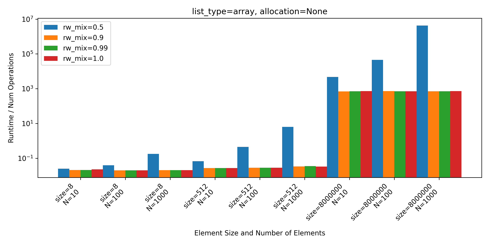
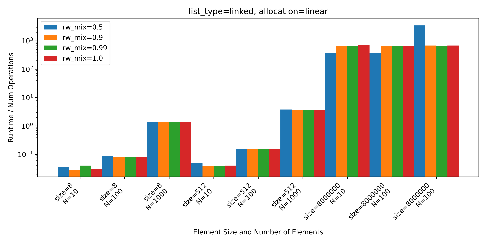
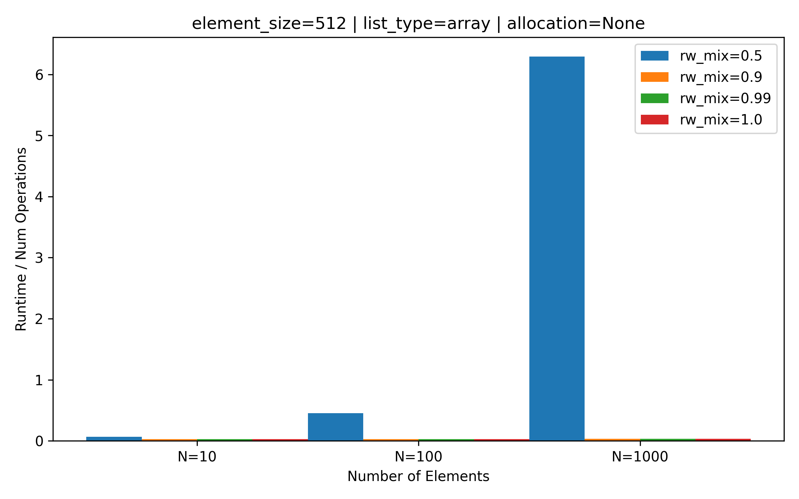
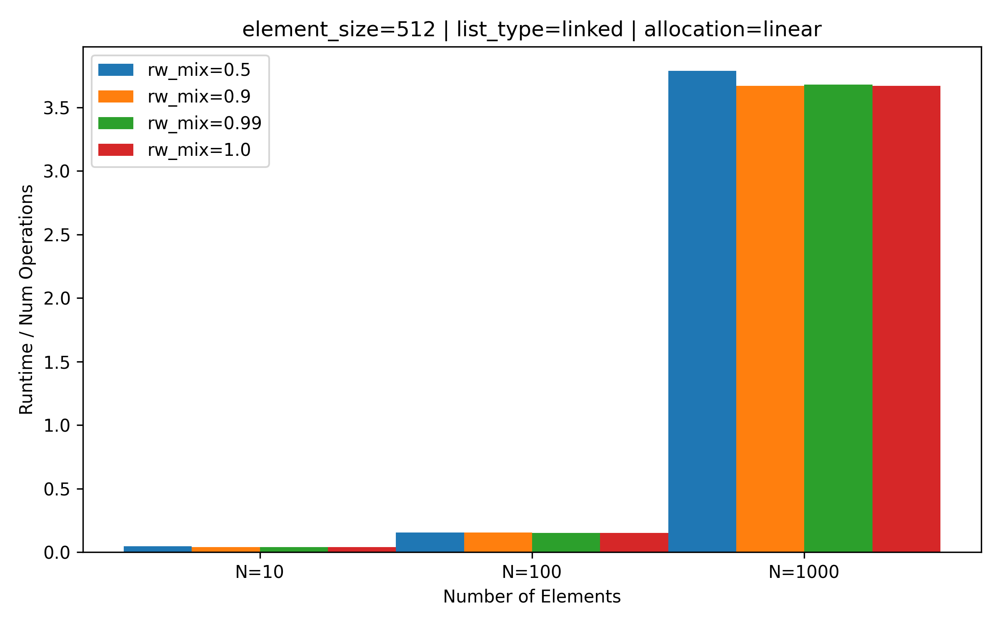
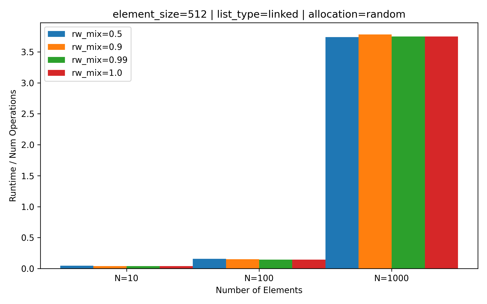

# VU Performance Oriented Computing -- Sheet 09

Author: Marco Fröhlich

## List Implementations

I choose to implement for both list types a common interface to make my life easier with the benchmarking tool. The linked list implementation is based on the `std::forward_list()` and the array list I did my self.

## Benchmarking Tool

To ensure that the compiler does not remove write and read calls the value from the previous read call always XOR's on a buffer value, which is used in the following write call. To support the difference in data size, always the whole memory location gets copied, even though only the first byte of data is used in the described operation. Since an XOR operation on 1 byte of data is a negligible operation compared to the `memcpy()` call required to actually read the data this will not have an impact in the performance.

To fulfill the requirement that the number of operations should be greater than the number of elements I choose to use a common multiplier of 10 on the element count for all configurations.

Since the initialization of the linked list implementations took so long and the rest of the timeframe on LCC3 was not long enough to get more than one run through with the linked list implementation and the element-counts 100000 and bigger I choose to not do them. Instead, I benchmarked the implementations with [10,100,1000] elements. I chose to do so since I do not find it reasonable to start a multitude of `slurm` jobs that all take more or less the whole timeframe of 30 minutes and then get only one benchmarking run through. In my opinion this is an unnecessary waste of computing resources to prove the point that array list have better access times than linked lists. Using a different `malloc` implementation as in a previous exercise did not solve the issue.

## Results

For the array list the runtime per operation only depended on the element size and the operation mix. Inserting and deletion of elements takes significantly more time than read and write.

For linked lists this also holds true, but there is not such a significant difference between the insert/delete and read/write.

In the plots above a more detailed view of the runtime per operation for a fixed item-size of 512 bytes. As said before insert and delete take significantly more time than reading and writing operations. For the linked lists it can be seen that the linear initialized list is faster for reading and writing than the random one. In the random initialized version there is basically no difference between read/write or insert deletion operations.