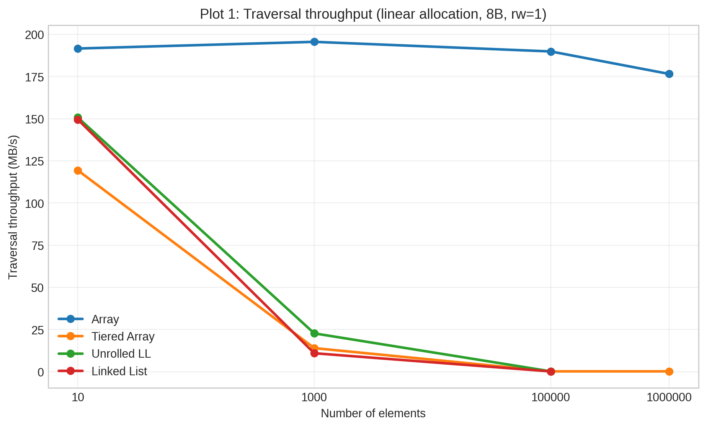
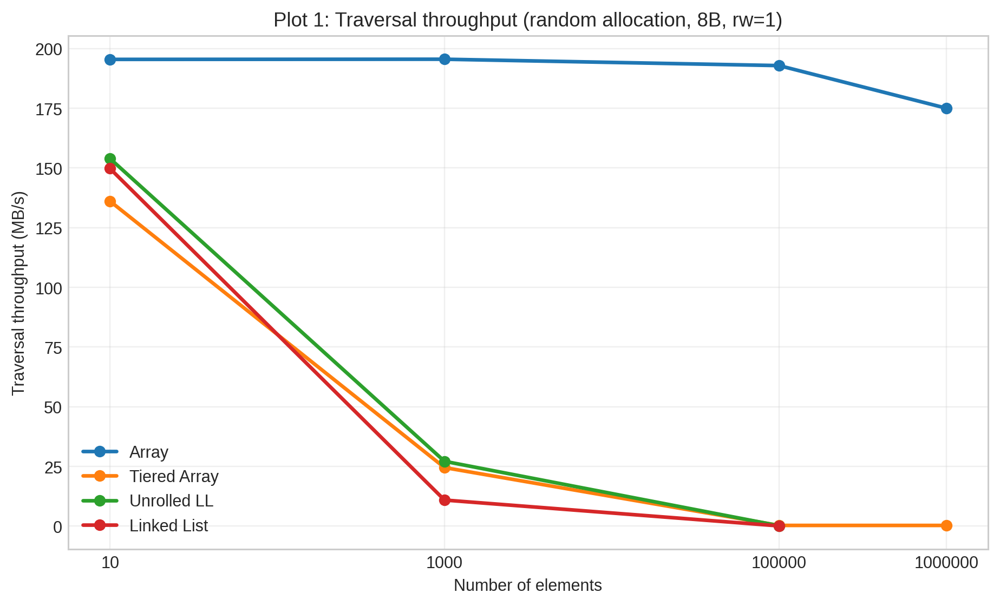
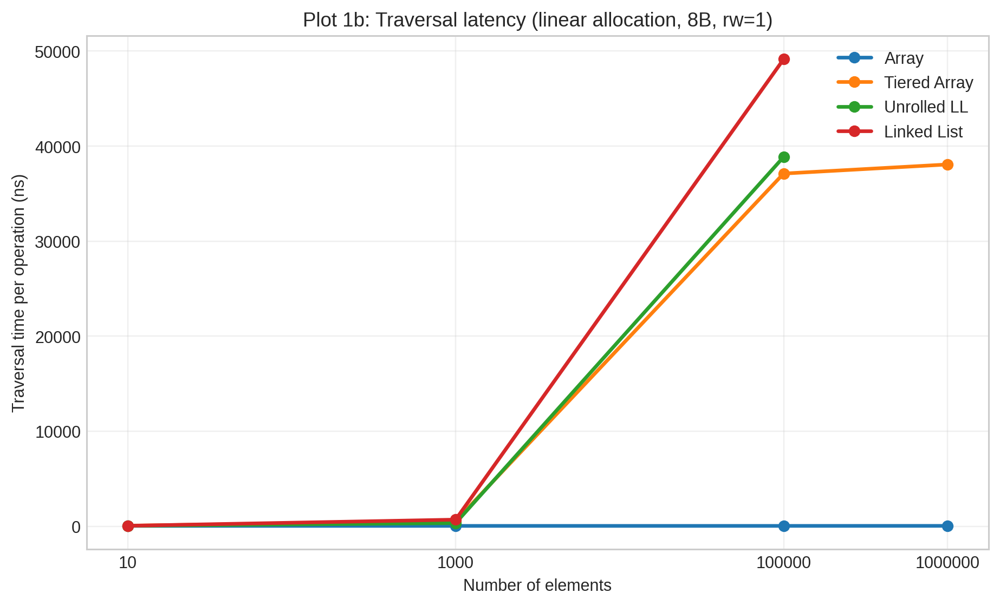
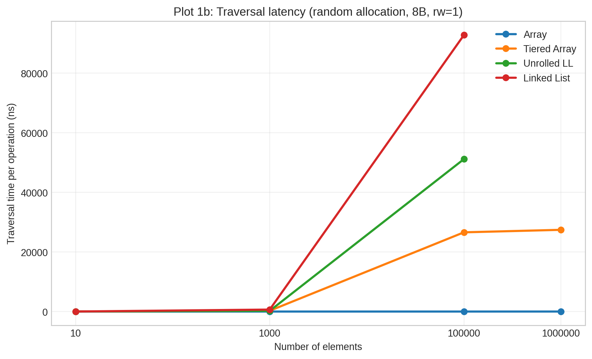
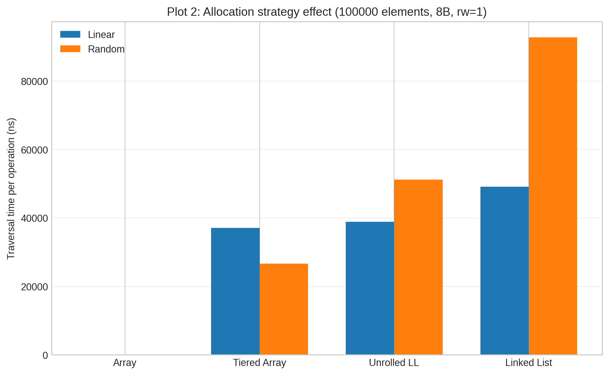
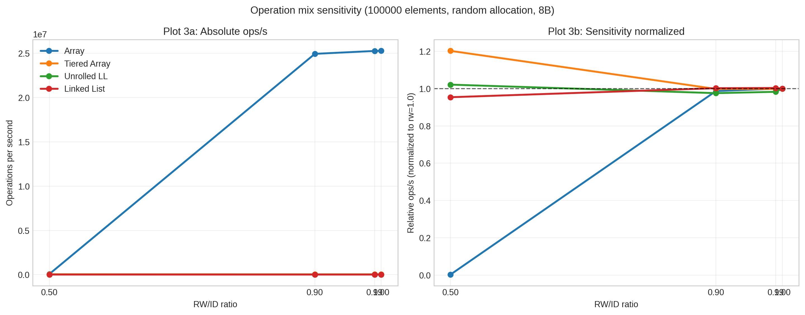
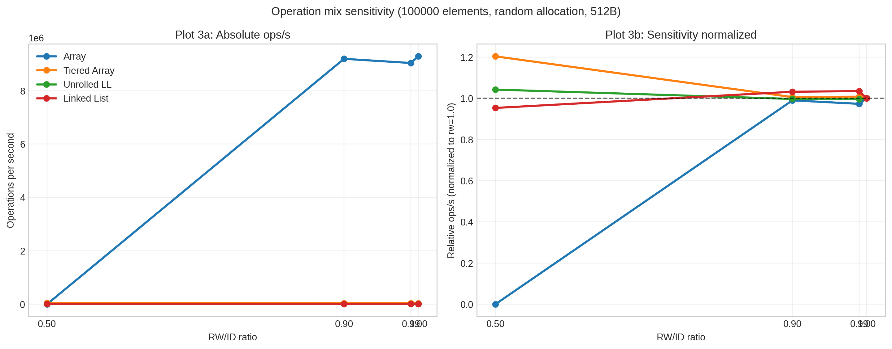
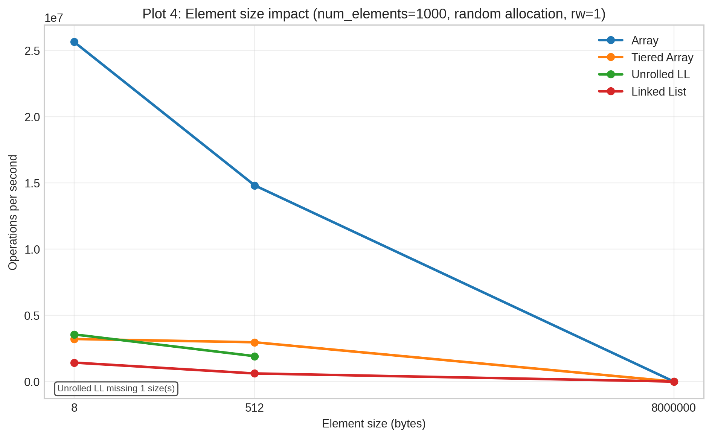
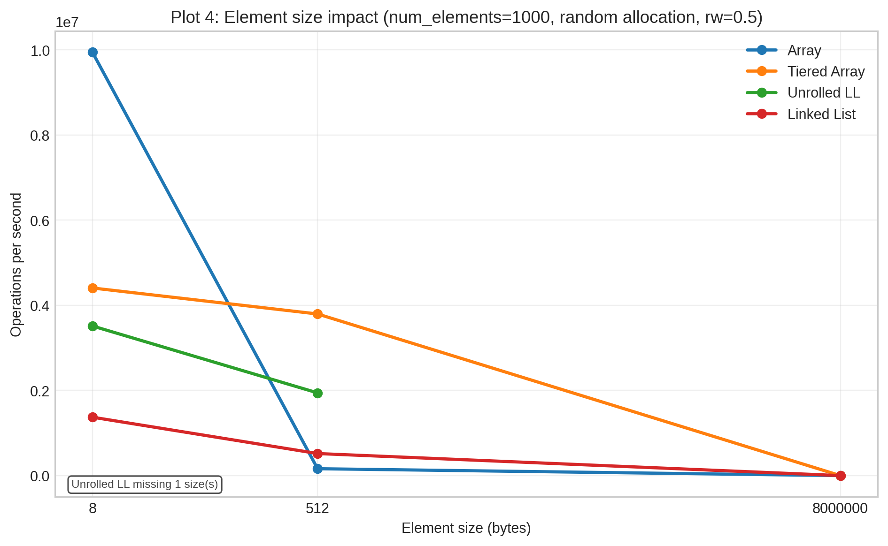

# VU Performance Oriented Computing -- Sheet 10

---

Authors: Marco Fröhlich and Timo Plieth

## List implementation

As of in the last submission of Marco Fröhlich, all list types implement a common interface with the required methods for `read, write, insert` and `delete`. The actual implementation serves than as a wrapper class around the `cpp` native implementations of `std::vector` and `std::forward_list`. Only the implementation for unrolled linked list differs from this patter, as for simplicity reasons implements its own linked list for the high level nodes.

## Benchmark implementation

This benchmark implementation changed its benchmarking strategy. In this new implementation it changes from the performing a certain number of operations to giving each test a time frame of 2 seconds to perform as many operations as possible. Each experiment configuration gets initialized once and then gets repeated 10 times each and the average of the operation count gets returned. This pattern does violate the best practice of a benchmark to space repetitions of the same test as far as possible. This is because during testing it was notices that the initialization of the lists takes significantly more time than the actual benchmarking, especially with the random initialization for lists using `std::vector` at their core. Therefor the authors traded this minor result inaccuracy to save on time by getting as many test runs done per time window on LCC3 as possible.

For the random traversal benchmarks a very simple random number generator based on three `xor` and three bit shifts was chosen instead of the precomputing the numbers. Both traversal methods are intentionally implemented to use a modulo operation to keep the index in the required range, even though a faster version with comparison and reset would be possible. We argue that the additional six logical operations, to generate the new random index from the last one, do not introduce much overhead compared to the very expensive modulo operation on `size_t` especially as the divisor is not known on compile time.

## Results

_Disclaimer:_ Our setup was not able to run all of the required configurations in the given time frame on LCC3. Some combinations of item size and algorithm where not possible to run.

## Figures

### Plot 1: Traversal performance, 8B

These plots compare traversal throughput and latency for 8-byte elements.
Array remains the fastest for pure traversal, while the gap to the other structures becomes clearer as the list grows.
The ns/op views show the same trend in inverse form.

### Plot 2: Allocation strategy effect, 8B

This plot shows the difference between linear and random allocation.
For the linked list the difference is the biggest and a little less, though a similar trend is seen for the unrolled linked list. The tiered array on the other hand has a better performance with random initialization.
Possible reasons: Random init might put elements more favorable in memory for the later traversal. Locality between the higher level could be better.

### Plot 3: Operation mix sensitivity, 100000 elements, random allocation

The 8-byte plot shows how performance changes as the workload moves from read-heavy to more mixed read/write activity. Here more insert/delets have the biggest impact on the array, while the other structures are a lot more stable in this case. But the array still performs better for lower insert delete number and similar in a 50 50 scenario.
The normalized view highlights relative sensitivity more.

The 512-byte version gives a similar result.

### Plot 4: Element size impact

This plot compares how element size affects throughput when the workload is read-heavy.
Here the array still outperforms the others but with increasing size it also worsens more than the others.

With the more mixed workload, the differences between the structures become more visible.
As soon as the size increases the array is outperformed by the other structures.
