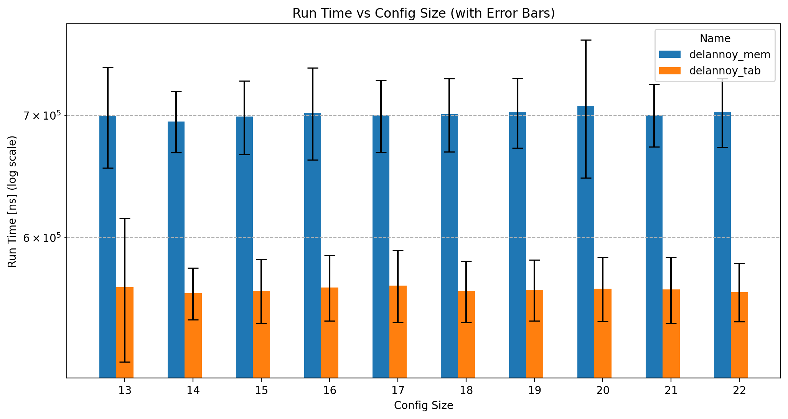

# VU Performance Oriented Computing -- Sheet 11

Author: Marco Fröhlich

## Task A - Applying Memorization

> What level of performance improvement can you achieve, both theoretically and practically? 

In theory the baseline approach has a time complexity of $O(3^{x*y})$ since each call requires 3 recursive calls. The memorization approach only has a time complexity of $O(x*y)$ since there are only that many distinct sub-problems that can be computed. 
For the practical improvement see the **Result** section below.

> What is the space complexity of your optimized version in terms of the parameters `x` and `y`?

The space complexity of my optimized version is $O(x+y)$ since each combination of these parameters potentially produces a different result and therefor needs its own storage space. In the implementation I only allocated space for 10000 entries in the hash table.

## Task B - Applying Tabulation
For a comparison see below.

## Results

Since the execution times for these optimization times are in the sub-millisecond range even for the variance in runtime is pretty high as can be seen by the error bars. These results are the average of 200 individual runs per configuration. As to be expected the execution times for increased problem sizes stay basically the same, since each additional step only requires on additional computation step. In the memorization approach this step takes longer since it requires to-do three look-ups in the hash-table. Whereas in the tabulation approach it only requires to add adjacent cells, which is much more cache efficient. 

### Absolute Runtimes
| Implementation type   | problem Size | Average run_time (s) |
| --------------------- | ------------ | -------------------- |
| delannoy              | 13           | 3.367075             |
| delannoy              | 14           | 12.261423            |
| delannoy              | 15           | 142.974791           |
| delannoy memorization | 13           | 0.000698             |
| delannoy memorization | 14           | 0.000679             |
| delannoy memorization | 15           | 0.000671             |
| delannoy tabulation   | 13           | 0.000568             |
| delannoy tabulation   | 14           | 0.000569             |
| delannoy tabulation   | 15           | 0.000569             |

### Speed-up to Recursive implementation

| name                  | config_size | Relative Speed-up |
| --------------------- | ----------- | ----------------- |
| delannoy memorization | 13          | 4823.89           |
| delannoy memorization | 14          | 18 058.03         |
| delannoy memorization | 15          | 213 077.50        |
| delannoy tabulation   | 13          | 5 927.82          |
| delannoy tabulation   | 14          | 21 549.03         |
| delannoy tabulation   | 15          | 251 272.41        |
|                       |             |                   |

The basically constant runtime behavior results in these ridiculous speed-ups relative to the naive recursive implementation.

